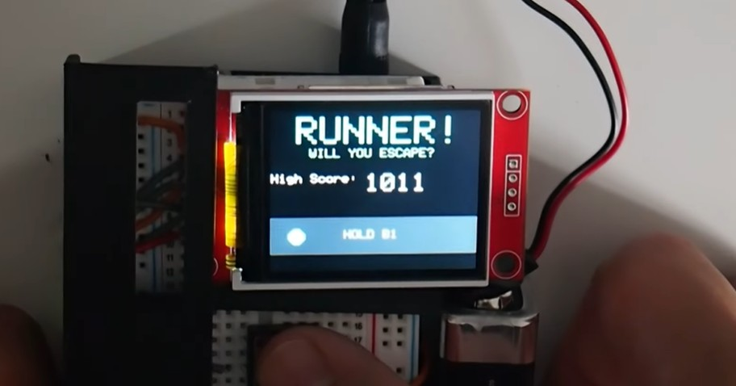

<h1 align="center">
  
    <b>Engineering Projects Portfolio</b>
  
</h1>

  This page shows the various personal projcts I have made. For more information please visit my <a href="https://www.youtube.com/@Ansh_Builds_Things" target="_blank">Youtube Channel.</a>

---

## Custom Game Console & Game

<table>
  <tr>
    <td valign="left"></td>
    <td valign="left"></td>
  </tr>
  <tr>
    <td valign="top"><b>What</b> 
      - Fully custom designed and built 'Handheld Game Console' on the Arduino Uno microcontroller with a custom encloser   - Custom 2D game *Runner* developed for said hardware 
    </td>
    <td valign="top"><b>How</b> 
      - Schemetics were designed to connect all components  
      - All systems were wired togather and tested with a simple arduino programs (e.g. checking for button-press detection and screen operation)  
      - Final game software designed and created around hardware constraints (e.g. very limited ram, low clock speeds, single input button)  
      - Final program was upload and system was tested with a 9V battery power source
    </td>
  </tr>
</table>

---
